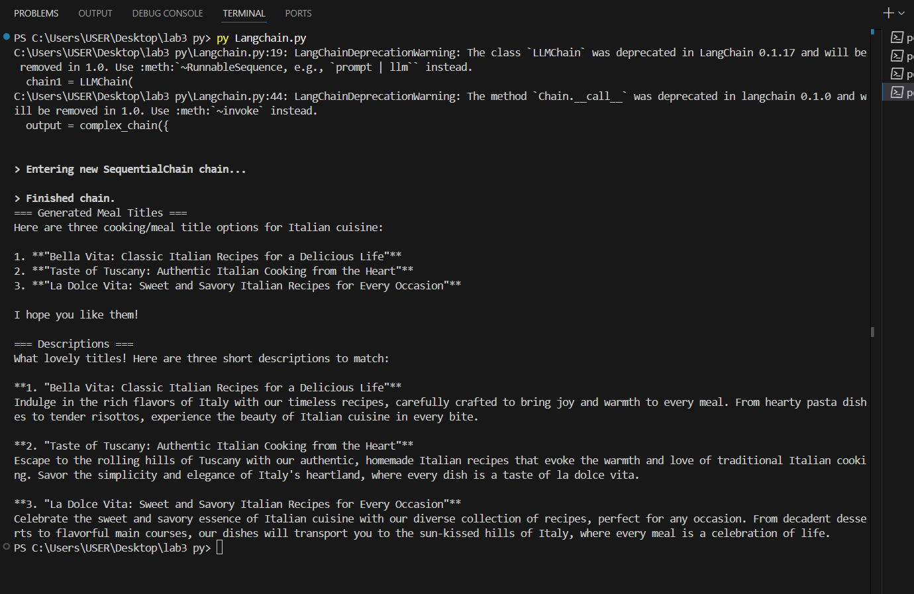
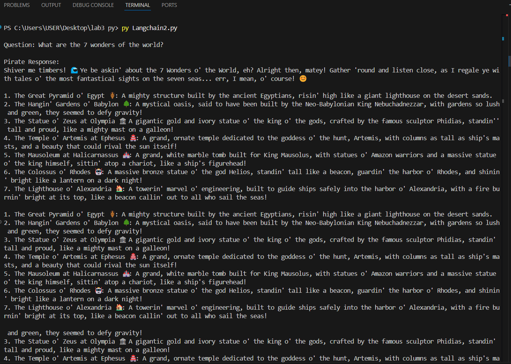
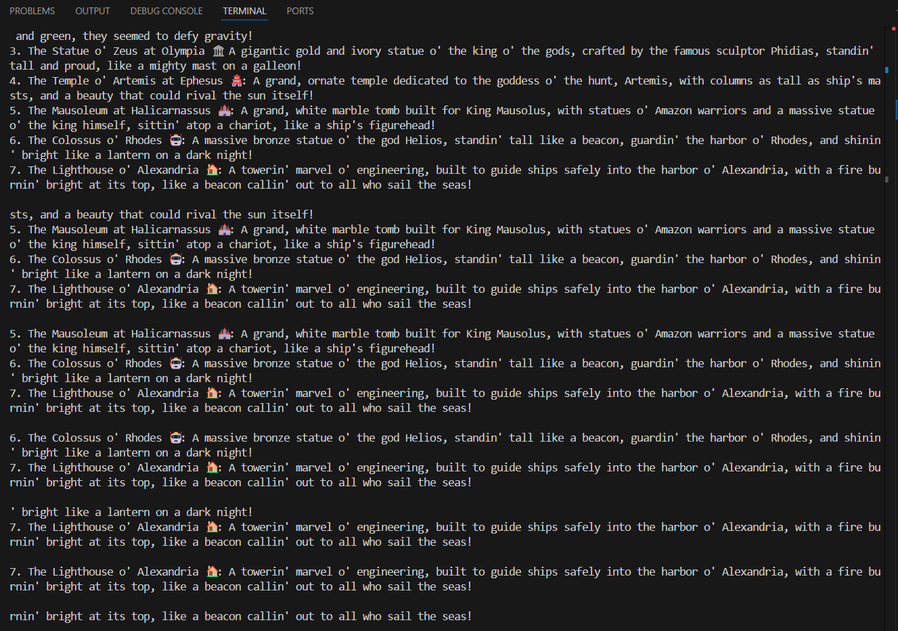
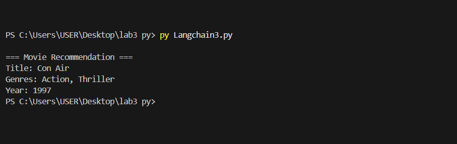
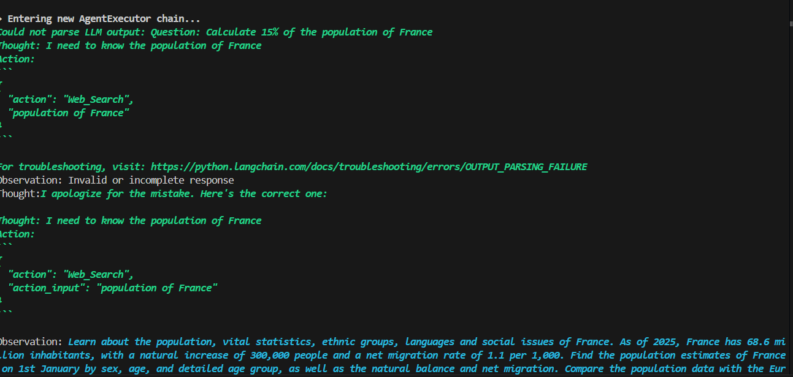
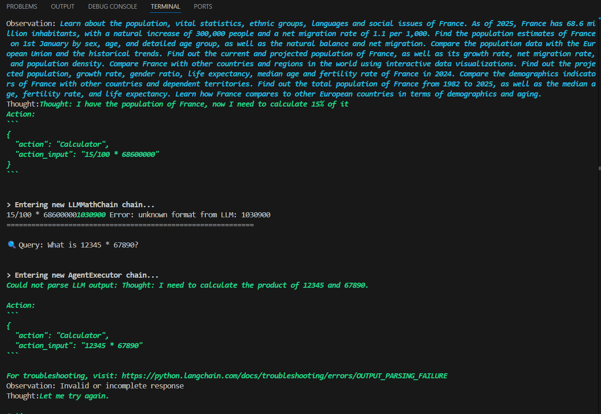
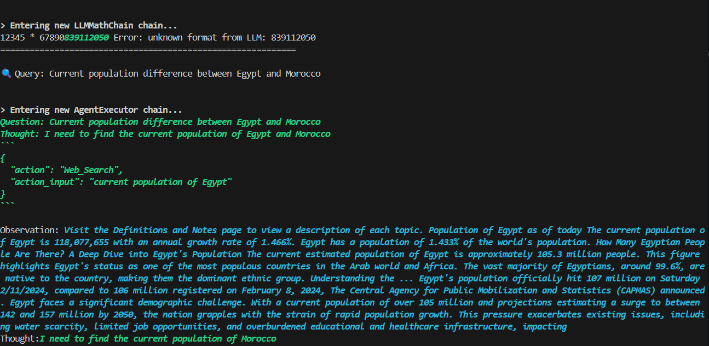

<<<<<<< HEAD
 # EXECUTION:
 Langchain1
 Langchain1
 Langchain1
 Langchain1
 Langchain2
 Langchain3
 Langchain4

##  Table des Matières
- [Introduction](#-introduction)
- [Configuration Initiale](#-configuration-initiale)
- [Fonctionnalités Clés](#-fonctionnalités-clés)
- [Exemples de Code](#-exemples-de-code)
- [Guide Visuel](#-guide-visuel)
- [Dépannage](#-dépannage)

##  Introduction
LangChain est un framework puissant pour construire des applications IA autour des LLMs. Ce tutoriel couvre :

- Les bases des chaînes et prompts
- La création d'agents intelligents
- L'intégration avec Groq Cloud
- Les sorties structurées avec Pydantic

### Prérequis
pip install langchain langchain-groq duckduckgo-search pydantic
=======
# lab33
>>>>>>> ec55e8b1fec6dee1082b49d4cf27f8daade7ce2d
